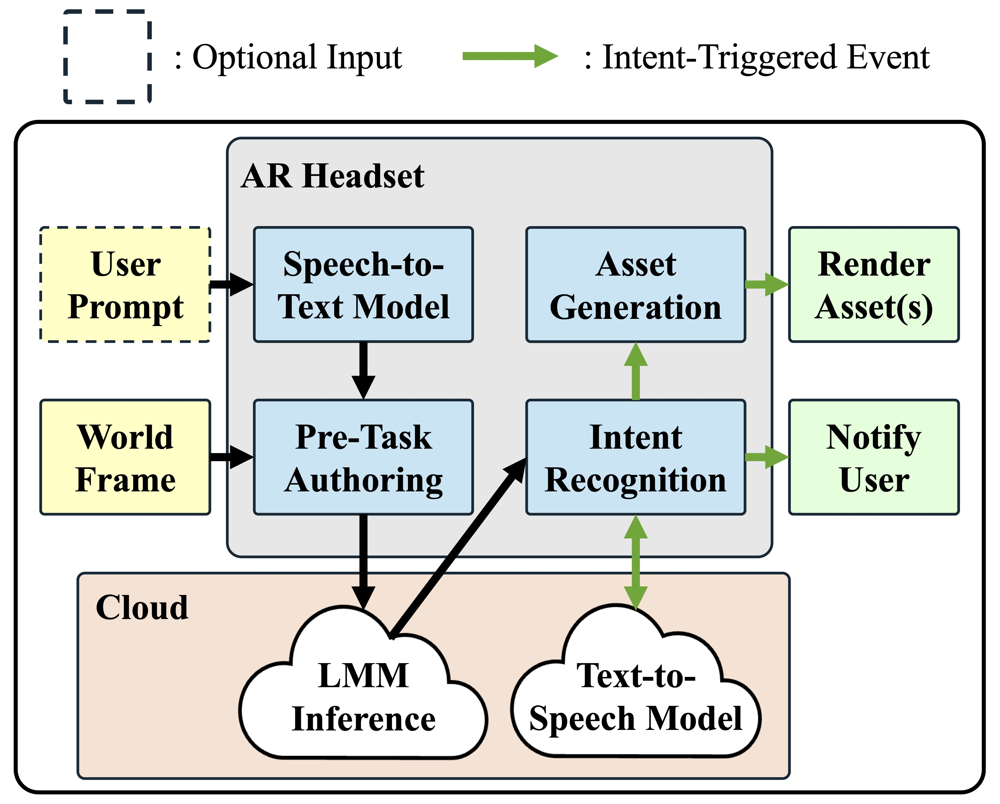
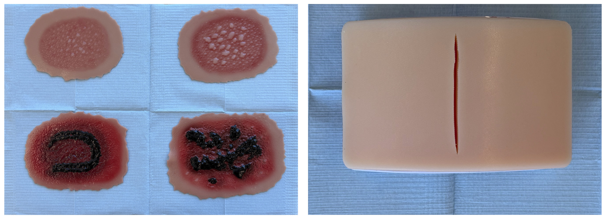
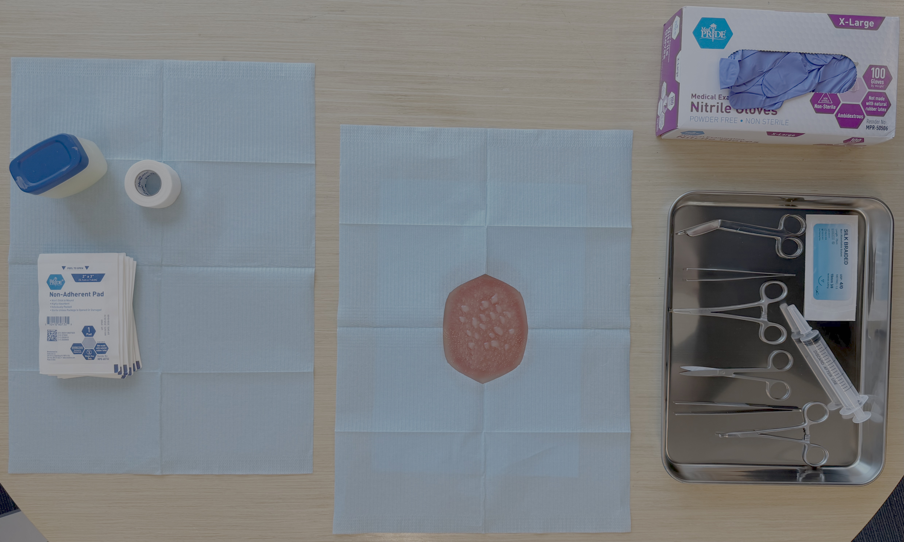

<div align="center">

# PLaSMA

### Leveraging Large Multimodal Models in Real-Time as Safety Assistants in Augmented Reality

<!-- [](https://xrsecurity.github.io/2026/)  -->
[](https://xrsecurity.github.io/2026/) 
[](https://doi.org/10.1145/3842203.3844593)
[](https://youtu.be/q21ZAfFpdZE)

[**Elias Rotondo**](https://scholars.duke.edu/person/eli.rotondo) · [**Maria Gorlatova**](https://maria.gorlatova.com/bio/)

[*Intelligent Interactive Internet of Things (I³T) Lab*](https://gorlatova.pratt.duke.edu) · [Duke University](https://www.duke.edu)

This is the official repository for the XR Security 2026 demonstration<br>
"**Leveraging Large Multimodal Models in Real-Time as Safety Assistants in Augmented Reality**"

</div>


## Overview



<div align="center">

**PLaSMA:** *<u>**P**</u>erceptual <u>**L**</u>anguage-<u>**a**</u>ssisted <u>**S**</u>afety <u>**M**</u>ultimodal <u>**A**</u>R*

</div>

Augmented reality (AR) enables dynamic interactions between users, digital content, and real-world environments. However, it can also introduce safety concerns by increasing cognitive overload and decreasing situational awareness. In this demonstration, we present *PLaSMA*, a large multimodal model (LMM)-based safety assistant for real-time AR. Users complete a simulated medical task using an AR head-mounted display system and observe *PLaSMA*'s safety monitoring and problem-solving capabilities and limitations. This work highlights LMM integration to improve perceptual safety in AR applications.


## Medical Scenarios



While completing the demonstration, participants will be presented with one of two representative medical simulations: a burn wounds or an open incision. We construct an artificial outpatient workspace using surgical instruments, training kits, and silicone anatomical models, shown below. As a participant safety precaution, sharp cutting instruments and other hazardous tools are excluded.




## Citation

If you use this work in any way, please cite:
```bibtex
[BibTeX pending official publication; stay tuned!]
```


## Contact

If you have any questions or would like to discuss collaboration opportunities, please reach out to the corresponding author:

- **Elias Rotondo** — eli.rotondo (AT) duke.edu


## Acknowledgments

This work was supported in part by NSF grants CSR-2312760, CNS-2112562, and IIS-2231975, NSF CAREER Award IIS-2046072, NSF NAIAD Award 2332744, a CISCO Research Award, a Meta Research Award, Defense Advanced Research Projects Agency Young Faculty Award HR0011-24-1-0001, and the Army Research Laboratory under Cooperative Agreement Number W911NF-23-2-0224. The views and conclusions contained in this document (repository) are those of the authors. They should not be interpreted as representing the official policies, either expressed or implied, of the Defense Advanced Research Projects Agency, the Army Research Laboratory, or the U.S. Government. This paper has been approved for public release; distribution is unlimited. No official endorsement should be inferred. The U.S. Government is authorized to reproduce and distribute reprints for Government purposes, notwithstanding any copyright notation herein.